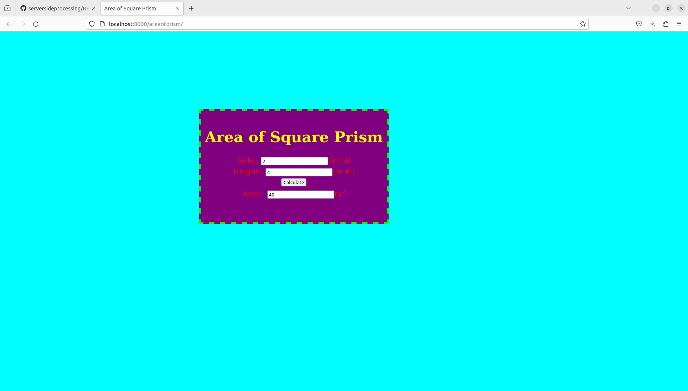
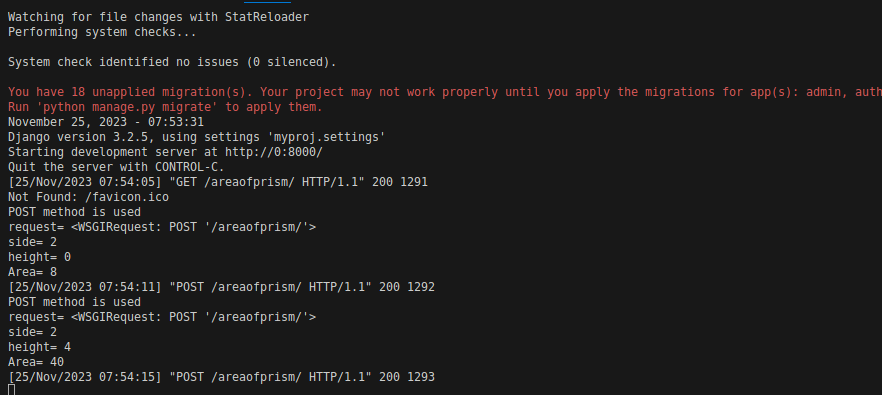

# Design a Website for Server Side Processing

## AIM:
To design a website to perform mathematical calculations in server side.

## DESIGN STEPS:

### Step 1:

Creating Repository:

    First, a path to make a folder where git needs to be created is identified.
    Fork the repository (https://github/gowriganeshns/serversideprocessing)
    Clone the repository

    git clone https://github.com/ShriSaiAravind/serversideprocessing

After cloning the folder with the repository name django-orm-app will be created

### Step 2:

    >Write the following commands

    cd serverside

    django-admin startproj myproj

    >Then move into the folder myproj where manage.py file is located. Now give the commands to create myapp

    python3 manage.py startapp myapp

    .Then change the necessary settings in the settings.py.

    from pathlib import Path
    import os

    ALLOWED_HOSTS = ['*']

    INSTALLED_APPS = [
    'django.contrib.admin',
    'django.contrib.auth',
    'django.contrib.contenttypes',
    'django.contrib.sessions',
    'django.contrib.messages',
    'django.contrib.staticfiles',
    'myapp'
    ]

    STATICFILES_DIR=[
    os.path.join(BASE_DIR,'static')
    ]

    TEMPLATES=[
    'BACKEND':'django.template.backends.django.DjangoTemplates',
    'DIRS':[os.path.join(BASE_DIR,'templates')]
    ]


### Step 3:

    Super User:

    ```
    python3 manage.py makemigrations
    python3 manage.py migrate
    python3 manage.py createsuperuser
    ```

    >Enter the admin and password according to your preferences.
    >You will receive the command Superuser successfully created.
    >Visit the admin app at (http://127.0.0.1:8000/admin) and log in with the superuser account that you have created:

### Step 4:

    Creating HTML File:

    >Write the following codes in the terminal to create math.html and result.html

    mkdir templates
    cd templates
    mkdir myapp
    touch math.html
    touch result.html
    cd..


### Step 5:

    Write the code: - Write the given codes in math.html and result.html

### Step 6:

    Publish the website in the given URL.

## PROGRAM :

    > In math.html

    <html>
    <head>
    <meta charset='utf-8'>
    <meta http-equiv='X-UA-Compatible' content='IE=edge'>
    <title>Area of Square Prism</title>
    <meta name='viewport' content='width=device-width, initial-scale=1'>
    <style type="text/css">
    body 
    {
    background-color:cyan;
    }
    .edge {
    width: 1080px;
    margin-left: auto;
    margin-right: auto;
    padding-top: 200px;
    padding-left: 300px;
    }
    .box {
    display:block;
    border: Thick dashed lime;
    width: 500px;
    min-height: 300px;
    font-size: 20px;
    background-color: purple;
    }
    .formelt{
    color: Red;
    text-align: center;
    margin-top: 5px;
    margin-bottom: 5px;
    }
    h1
    {
    color: yellow;
    text-align: center;
    padding-top: 20px;
    }
    </style>
    </head>
    <body>
    <div class="edge">
    <div class="box">
    <h1>Area of Square Prism</h1>
    <form method="POST">
    
    <div class="formelt">
    Side : <input type="text" name="side" value="{{s}}"></input>(in m)<br/>
    </div>
    <div class="formelt">
    Height : <input type="text" name="height" value="{{h}}"></input>(in m)<br/>
    </div>
    <div class="formelt">
    <input type="submit" value="Calculate"></input><br/>
    </div>
    <div class="formelt">
    Area : <input type="text" name="area" value="{{area}}"></input>m<sup>2</sup><br/>
    </div>
    </form>
    </div>
    </div>
    </body>
    </html>

    >In result.html

    <!DOCTYPE html>
    <html>
        <head>
            <title>SEC demo on server processing result</title>
        </head>
        <body>
            The result is {{result}}
        </body>
    </html>
    
## OUTPUT:

### Home Page:





## Result:

Now we have made area of prism calculator using server side processing


